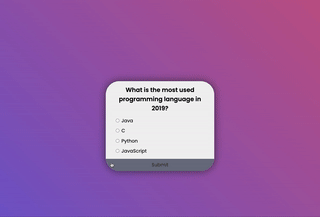

# Quiz App

HTML、CSS、JavaScriptを使用して作成された簡単なWebベースのクイズアプリケーションです。

## Demo

## Features

- 複数選択式の問題
- スコア追跡
- アニメーション付き背景グラデーション
- レスポンシブデザイン

## Usage

1. このリポジトリをクローンまたはダウンロードします。
2. `index.html`ファイルをブラウザで開きます。
3. クイズが開始され、最初の問題が表示されます。
4. ラジオボタンをクリックして、回答を選択します。
5. 「Submit」ボタンをクリックして、回答を送信します。
6. アプリケーションが自動的に次の問題に移動します。
7. すべての問題に回答したら、最終スコアが表示されます。
8. 「Reload」ボタンをクリックすると、クイズが再開します。
